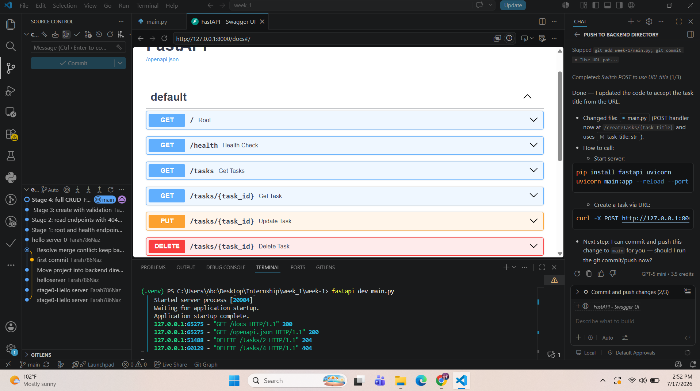

# Backend Task Manager API

An elegant, high-performance RESTful Task Manager API designed as part of my Backend AI Engineering internship. This service is built using **FastAPI** and **Pydantic** for automated data validation, strict type safety, and real-time interactive API documentation.

---

## How to Install & Run

Get the application running locally on your machine with this single setup and startup execution command.

### Prerequisite
Ensure you have Python installed, then run the following command in your terminal:

```bash
pip install fastapi uvicorn pydantic && uvicorn main:app --reload

